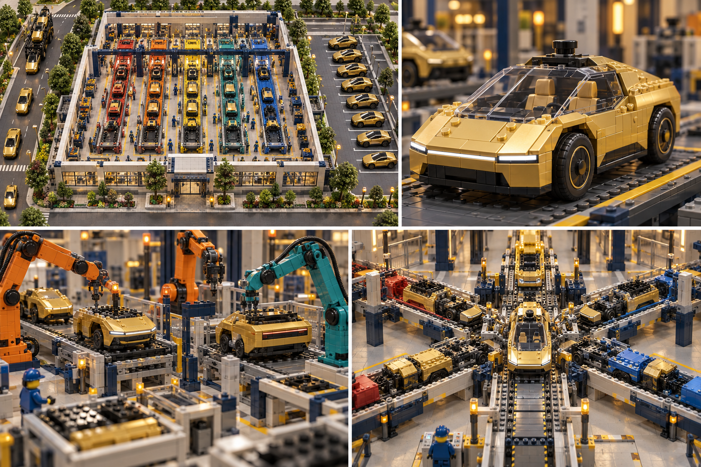
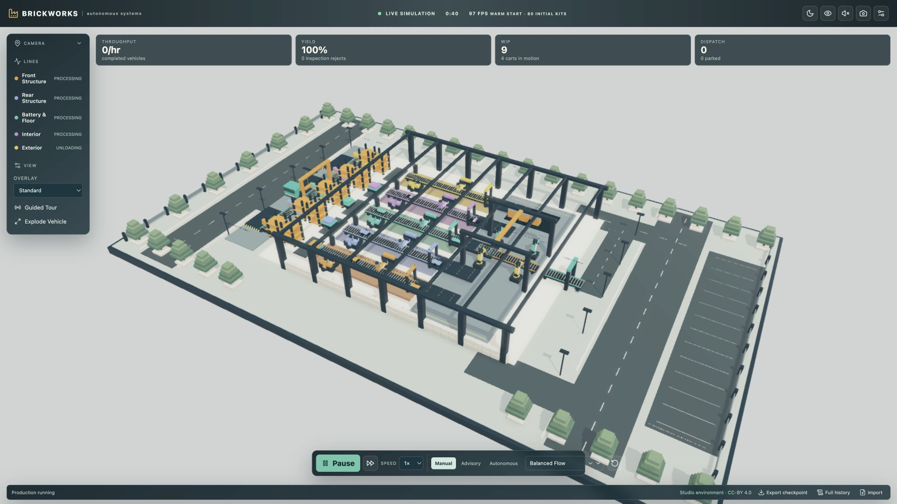
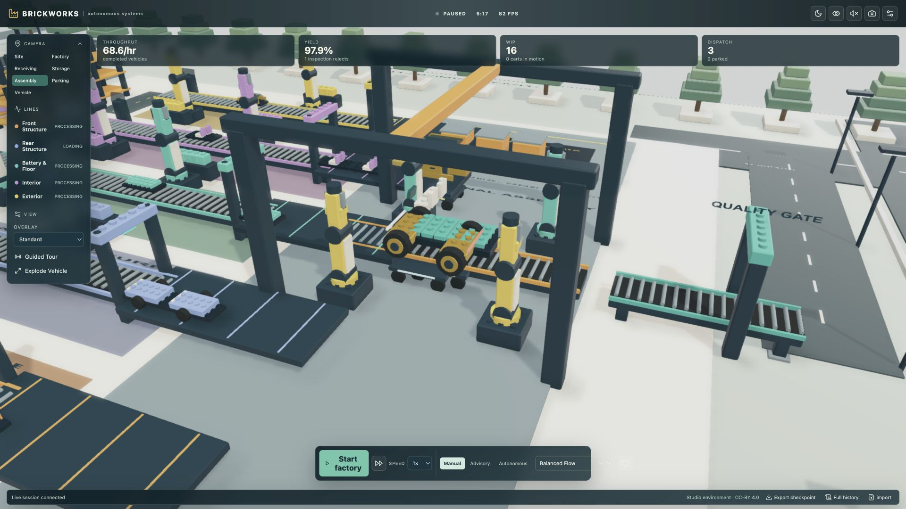
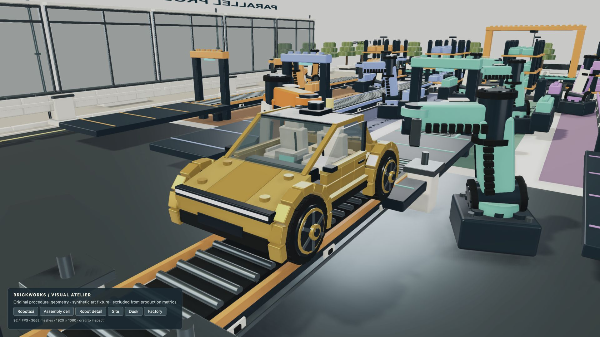

<div align="center">

# BRICKWORKS
### Build the factory in software. Learn from it. Bring it into the physical world.

**An open-source exploration of autonomous manufacturing—from the first delivery to the finished product.**

[**Explore the live factory →**](https://dark-factory-fszale.replit.app/) · [Follow the production tour](docs/guided-tour.md) · [See the visual roadmap](docs/plans/reference-graphics-upgrade.md)

</div>



*Where we are heading: original AI-generated concept art for Brickworks. This is the visual target, not a screenshot of the current application. [Asset provenance](docs/assets/README.md).*

## Why I am building this

I'm building a dark factory virtually first: a place to see how materials move, how machines cooperate, where production gets stuck, and how AI can help us make better operating decisions.

The first product is a brick-built gold robotaxi. It gives the factory a concrete challenge: manufacture five major components in parallel, bring them together late in the process, inspect the completed vehicle, and let it drive itself out to parking. The real subject is the factory around it—the deliveries, sorting, inventory, handling, assembly, quality, maintenance and dispatch that make autonomous production possible.

My next step is to build a physical version using LEGO-style bricks or similar mechanics. That tabletop factory will let me confront what software alone cannot prove: gripping, alignment, sensing, tolerances, reliability and safe operation.

The longer-term ambition is to find an investor and a plant partner, carry those lessons into a real manufacturing environment, and produce useful parts that help power our future industry. The final industrial product is still to be chosen. The robotaxi is our first learning model.

I'm making the project open source so others can explore it, challenge its assumptions, improve it, and help bridge the distance between a virtual factory and a useful physical one.

— **Filip Szalewicz**

## Step inside the working prototype

[**Launch Brickworks on Replit**](https://dark-factory-fszale.replit.app/). Start the factory, follow a shipment, inspect a station, introduce a disruption, or watch a vehicle reach its parking bay. The simulation is available without an AI key; paid live-AI controls require the private access code.

| The operating site | Inside the assembly hall |
| --- | --- |
|  |  |
| **Actual application capture** — the connected factory world | **Actual application capture** — component joining |

These captures show the current visual foundation. A [reference-led graphics upgrade](docs/plans/reference-graphics-upgrade.md) is in progress to bring the models, machinery, lighting and site detail much closer to the concept image above.



**Graphics checkpoint:** actual interactive renderer in the synthetic visual atelier, not a production run. The shared robotaxi geometry is used by the operating factory; [review evidence](docs/review/graphics-v2/review.md) records remaining visual work and measured performance.

**One continuous manufacturing journey:**

Delivery trucks → receiving and inspection → brick sorting and storage → material kits → five parallel component lines → final assembly and testing → autonomous drive-out → parking → dispatch.

| Parallel line | What it contributes |
| --- | --- |
| Front | Structure, axle, wheels and lightbar |
| Rear | Structure, simulated drive unit, axle and wheels |
| Battery / floor | Structural tray, simulated battery blocks and floor |
| Interior | Seats, console and cabin insert |
| Exterior | Gold panels, doors, canopy and roof |

Finite inventory and capacity create real constraints inside the simulation. Material lots connect to vehicle genealogy; faults and delays propagate through the factory. Live monitoring exposes throughput, quality, queues, utilization and simulated maintenance/economic observations.

Astra supervises the factory and TypeSafe Jev provides bounded operational judgments. Deterministic controllers validate their actions; models cannot bypass inventory or directly manipulate the 3D world. Energy, wear and cost values are simulated estimates, not measured industrial performance.

## From virtual factory to useful industry

| Stage | Purpose | Status |
| --- | --- | --- |
| **1 · Virtual factory** | Operate the full material-to-product loop, instrument it, and test orchestration | Working public prototype; acceptance evidence tracked separately |
| **2 · Visual and operational refinement** | Improve realism, usability, experiments and the reference product | Reference upgrade in progress; first vehicle/cell checkpoint reviewed |
| **3 · Physical tabletop factory** | Build with bricks or similar mechanics; validate real sensing, handling and control | Planned |
| **4 · Industrial pilot** | Select a useful product, seek investment and a plant partner, commission a bounded production process | Longer-term ambition |

The physical stages require their own engineering, safety and economic validation. A successful simulation is a way to learn faster, not proof that a production plant is ready.

## Build with us

Contributions are welcome in simulation correctness, production recipes, original 3D assets, visualization, metrics and future hardware adapters. Start with the [architecture](docs/architecture.md) and [station adapter boundary](docs/station-adapters.md), or [open an issue](https://github.com/fszale/dark-factory/issues) to discuss a concrete improvement.

For AI-assisted work, [AGENTS.md](AGENTS.md) routes to four project-specific skills under `.agent/skills`: factory development, visual review, release verification and project storytelling. They preserve the lessons and decisions behind this project as it grows.

## Run locally

Use Node.js 22 or later.

```sh
npm ci
cp .env.example .env
npm run dev
```

Open `http://localhost:5173`. The web development server proxies `/api` and WebSocket traffic to the Fastify server on port 3000. Production builds place the browser app in `dist/web` and bundle the server plus experiment and replay workers under `dist/server`:

```sh
npm run build
npm start
```

`npm start` reads `.env` when it exists. The server listens on `0.0.0.0`; use `PORT` to select its port (default: 3000).

## Explore and verify

Use the [guided tour](docs/guided-tour.md) to follow receiving, module production, final joining, faults, and dispatch. [Release evidence](docs/release-evidence.md) separates passed local checks from credential-dependent and deployment checks. [Graphics review](docs/graphics-review.md) includes measured 1080p performance.

Run `npm test` for deterministic engine, provider-boundary, audio, and API checks. Open `/benchmark.html` for the explicit synthetic rendering stress scene. Run `BRICKWORKS_TEST_URL=http://localhost:3000 node scripts/soak.mjs` against a production server for the two-hour wall-clock server/WebSocket check.

The final local source passed typecheck, production build, and **117 tests across 15 files**. The corrected two-hour server/WebSocket soak [passed](docs/review/release-soak-corrected.json): 121 scheduled samples reached 7,200.012 seconds with zero material/receiving imbalance and stream errors, strict frame growth, and bounded retained events/samples. Its [assessment](docs/review/release-soak-corrected-assessment.md) records measured memory and runtime hashes. The earlier finalization-limited artifact remains preserved separately. The application is now published on Replit. Both provider configurations and rejection of unauthenticated AI requests were verified on the public deployment; both providers have also returned genuine advisory responses through the public Intelligence panel. See the release evidence for latency, usage and scope.

## AI providers and privacy

The server can use OpenAI GPT-6 Astra through the Responses API and TypeSafe Jev through its SDK. `OPENAI_API_KEY` and `TYPESAFE_API_KEY` belong only in the server environment; neither key is sent to the browser, exported in a run, or committed. Without keys, provider-backed advice and live adaptive-policy comparison remain unavailable while the deterministic simulation still runs. Authorized local checks exercised both live adapters, Astra autonomous repair, and a genuine twenty-decision Jev adaptive comparison; [release evidence](docs/release-evidence.md) keeps those bounded results separate from fixture coverage and broader provider certification.

See [configuration](docs/configuration.md), [the architecture](docs/architecture.md), [simulation behavior](docs/simulation.md), and [test strategy](docs/test-strategy.md).

## Operating modes

Manual mode applies only user-issued commands. Advisory mode asks a provider for recommendations and leaves them for review. Autonomous mode may apply valid, schema-checked simulation commands within the active session. All decisions are captured with provider, command, revision, status, latency, and token metadata.

The runnable JSON checkpoint keeps a bounded working trace so it stays practical to import. A separate authenticated NDJSON history download preserves the session's complete event, command-outcome, and finished-vehicle lineage stream on server disk, subject to the documented retention and explicit quota marker. An authenticated replay request reconstructs a new paused graphical session at a requested simulation time in the latest reset epoch; it rejects truncated history. See [configuration](docs/configuration.md) for archive paths and limits.

## Scope and attribution

The scene geometry, procedural materials/audio, application code, and documentation are original MIT-licensed work. The visual language is generic brick-built industrial design: it uses no LEGO or Tesla corporate logos or supplied model assets. This is an independent educational model, not an affiliated or endorsed product. The sole non-original runtime asset is Babylon.js `studio.env`, served locally as lighting/reflection data under CC BY 4.0 with in-app attribution; see the asset inventory below. The system design is informed at a high level by public material-flow concepts, including [WO2024182432A1](https://patents.google.com/patent/WO2024182432A1/en), but does not reproduce Tesla's implementation, claims, drawings, or terminology. See [source and asset policy](docs/source-and-assets.md) and the [asset inventory](docs/assets/README.md).
