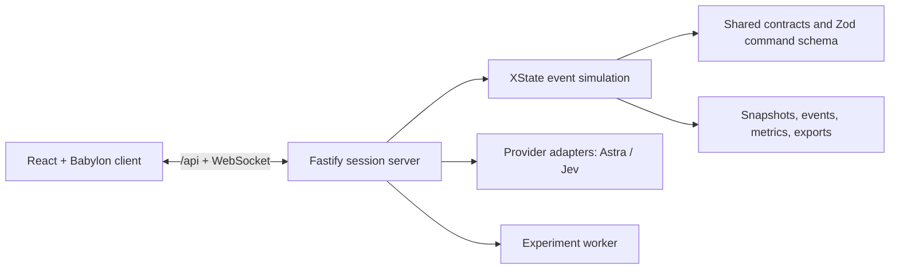

# Architecture

## Runtime shape

The browser is a React and Babylon.js experience served by Vite during development. The Node.js 22 Fastify process owns live sessions, HTTP APIs, and WebSockets. XState-based simulation logic advances an in-memory factory state and emits a versioned `FactorySnapshot`. Shared TypeScript contracts provide the boundary between the client, server, simulation, provider adapters, exports, and experiment worker.

Active sessions are bounded, in memory, and identified by the snapshot ID. They are not a durable production-control system. A run export includes the snapshot plus bounded internal replay state. A separate private NDJSON archive persists ordered event, command, decision, and completed-lineage evidence under explicit retention and disk quotas; authenticated replay uses that archive to create a new paused session.

## Factory flow

| Stage | Runtime record | Purpose |
| --- | --- | --- |
| Receiving | `Truck`, warehouse inventory | Truck approaches, waits, unloads, then departs with lot attribution. |
| Parallel module lines | `StationState` and `ModuleInstance` | Five stations process front, rear, battery, interior, and exterior modules. |
| Movement | `Cart` | Carts load, travel, unload, and return with line, lot, amount, and charge. |
| Joining and validation | `Vehicle` | One accepted module from each line forms a gold robotaxi, then testing determines pass/rework. |
| Driving, parking, dispatch | `Vehicle.phase` | Passed vehicles travel outbound, occupy parking, and dispatch after dwell time. |

The canonical line IDs are `front`, `rear`, `battery`, `interior`, and `exterior`. Their cycle times, colors, and scene positions live in `packages/contracts/src/index.ts` as `LINE_META`; user-facing labels should derive from that record.

## Commands and consistency

Every command is validated by the shared strict Zod schema. Commands carry optional revision and epoch values so the server can reject stale intent after reset or a concurrent change. Each successful command returns the current revision. Snapshots declare format version `1` and record the seed, scenario, configuration, decisions, events, samples, metrics, provider status, and active faults.

Provider responses are converted to the same command shape. A provider cannot directly mutate a session. The server records applied, advisory, rejected, pending, and error decisions so operators can distinguish advice from actual state changes.

### Live stream work budget
The server scheduler reads immutable scalar status instead of cloning retained history for housekeeping. Sessions without pending AI aftermath advance directly. Each session serializes a live snapshot at most once per stream sequence and shares it among viewers; slow sockets skip superseded frames above a 512 KB outbound backlog. Live event display retains the latest 200 events, while full REST snapshots, checkpoints, chart retention and durable history exports remain unchanged.
