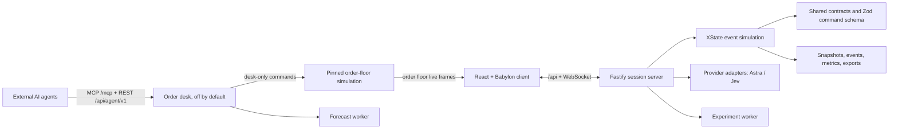

# Architecture

## Runtime shape

The browser is a React and Babylon.js experience served by Vite during development. The Node.js 22 Fastify process owns live sessions, HTTP APIs, and WebSockets. XState-based simulation logic advances an in-memory factory state and emits a versioned `FactorySnapshot`. Shared TypeScript contracts provide the boundary between the client, server, simulation, provider adapters, exports, and experiment worker.

```mermaid
flowchart LR
  W[React + Babylon client] <-- /api + WebSocket --> S[Fastify session server]
  S --> M[XState event simulation]
  M --> C[Shared contracts and Zod command schema]
  S --> P[Provider adapters: Astra / Jev]
  M --> E[Snapshots, events, metrics, exports]
  S --> X[Experiment worker]
  A[External AI agents] -- MCP /mcp + REST /api/agent/v1 --> D[Order desk, off by default]
  D -- desk-only commands --> F[Pinned order-floor simulation]
  D --> Q[Forecast worker]
  F -- order floor live frames --> W
```

Active sessions are bounded, in memory, and identified by the snapshot ID. They are not a durable production-control system. A run export includes the snapshot plus bounded internal replay state. A separate private NDJSON archive persists ordered event, command, decision, and completed-lineage evidence under explicit retention and disk quotas; authenticated replay uses that archive to create a new paused session.

## Factory flow

| Stage | Runtime record | Purpose |
| --- | --- | --- |
| Receiving | `Truck`, warehouse inventory | Truck approaches, waits, unloads, then departs with lot attribution. |
| Parallel module lines | `StationState` and `ModuleInstance` | Five stations process front, rear, battery, interior, and exterior modules. |
| Movement | `Cart` | Carts load, travel, unload, and return with line, lot, amount, and charge. |
| Joining and validation | `Vehicle` | One accepted module from each line forms a gold robotaxi, then testing determines pass/rework. |
| Driving, parking, dispatch | `Vehicle.phase` | Passed vehicles travel outbound, occupy parking, and dispatch after dwell time. |

The canonical line IDs are `front`, `rear`, `battery`, `interior`, and `exterior`. Their cycle times, colors, and scene positions live in `packages/contracts/src/index.ts` as `LINE_META`; user-facing labels should derive from that record.

## Commands and consistency

Every command is validated by the shared strict Zod schema. Commands carry optional revision and epoch values so the server can reject stale intent after reset or a concurrent change. Each successful command returns the current revision. Snapshots declare format version `1` and record the seed, scenario, configuration, decisions, events, samples, metrics, provider status, and active faults.

Provider responses are converted to the same command shape. A provider cannot directly mutate a session. The server records applied, advisory, rejected, pending, and error decisions so operators can distinguish advice from actual state changes.

## Order desk (DF-ORDER-001, off by default)

The order desk lets outside AI agents buy virtual robotaxis from the simulation. Its spec is [vehicle-order-mcp](plans/vehicle-order-mcp.md). Nothing is registered as active unless `ORDER_DESK_ENABLED=true`. With the flag off, every desk path (`/mcp`, `/api/agent/v1/*`, the discovery documents, `/api/order-floor/*`) answers 503, no floor exists, and visitor sessions are unchanged.

| Part | Code | Role |
| --- | --- | --- |
| Contracts | `packages/contracts/src/orders.ts` | Strict Zod schemas for the eight tools, order views, updates, the floor desk view and the `orders` live frame. |
| Order core | `packages/orders` | Catalog, feasibility, virtual price book `pb-2026-10-v1`, XState 5 lifecycle machines, the bridge from factory audit entries to order events, the seeded virtual carrier, forecasting by forking the floor, the desk (quotes, placement, idempotency, cancel, update log, cursors), and archive replay. |
| Order floor | `apps/server/src/order-desk/floor.ts` | One pinned `FactorySimulation` with id `order-floor`, outside session expiry and `maxSessions`, locked to manual mode. It advances in fixed 0.125 second real-time steps so forecasts are exact, persists atomically to `ORDER_DATA_DIR/order-floor.json`, and writes its own NDJSON archive. |
| Transports | `mcp.ts`, `rest.ts`, `discovery.ts` | MCP Streamable HTTP through the official SDK, with Origin and Host checks and sessions bound to the agent. A REST mirror with long poll and SSE. OpenAPI generated from the same Zod schemas. `/llms.txt`, `/mcp/server-card`, `/.well-known/mcp.json` and `/.well-known/mcp/catalog.json` from one tool registry. |
| Access | `auth.ts`, `config.ts` | Bearer agent keys stored only as SHA-256 hashes, scopes, per-agent caps, and a shared forecast queue (concurrency 1). Rate limits come in two layers. Loose flood windows (failed auth per IP, any call per agent, anonymous per IP) run before validation. The strict quote and place budgets are charged only after auth, validation, the kill switch and the intake pause, and a placement is charged only when an order is about to be created. |
| Operator | `index.ts` | `/api/order-floor/*`: status, view, allowlisted floor commands, carrier hold and release, intake pause, the runtime kill switch, and export and import. Each needs the operator access code when one is configured. |
| Web | `apps/web/src/OrdersPanel.tsx`, `OrderToast.tsx`, `orderFloor.ts` | Orders tab with a read-only "Watch order floor" view fed by `{ view: "order-floor" }` on `/api/live`. Live frames are batched per task (each validated, only the newest rendered). The incoming-order toast counts painted foreground frames, so a slow software-GL client still sees it. |

Authority stays with the server. The desk sees the floor only through `subscribeEvents` audit entries and can issue only `order-agent-create` and `order-cancel`. Agents never touch `FactorySnapshot`, and the generic session command route rejects `order-agent-create` with 403. Every agent-facing body says `virtual: true` with the disclaimer, and the price currency is the literal `BWC-VIRTUAL`. One helper, `withVirtualNotice` in the contracts, is applied in `OrderDeskService.call` (every REST and MCP tool result) and `OrderDeskError.body()` (every error), and also to SSE events and webhook bodies. JSON-RPC envelopes carry the notice in `result._meta` and `error.data`, including the SDK transport's own 4xx bodies. MCP tool calls go through the desk's own `tools/call` handler, so MCP and REST validate input with the same schemas and return the same error body.

### Live stream work budget
The server scheduler reads immutable scalar status instead of cloning retained history for housekeeping. Sessions without pending AI aftermath advance directly. Each session serializes a live snapshot at most once per stream sequence and shares it among viewers; slow sockets skip superseded frames above a 512 KB outbound backlog. Live event display retains the latest 200 events, while full REST snapshots, checkpoints, chart retention and durable history exports remain unchanged.
