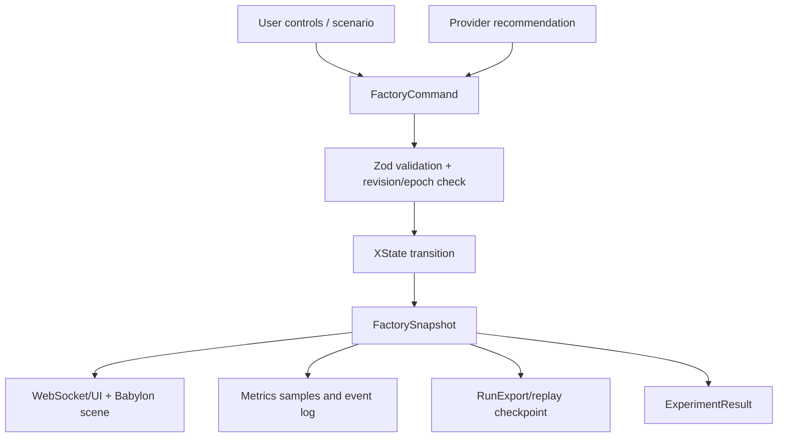

# Data lineage and runtime schema inventory

## Data flow

Commands contain an ID, type, optional station/value/scenario, and optional revision and epoch. The server validates them before the simulation consumes them. Browser controls and provider suggestions both use this same boundary, preventing a provider from writing arbitrary state.

## Contract inventory

| Contract | Source | Key lineage |
| --- | --- | --- |
| `FactoryConfig` | user control / reset config | seed, scenario, capacities, rates, profiles, material priority, and shared loading capacity → new run state |
| `ModuleInstance` | line processing | line + lot + acceptance/rework + ordered inspection/rework timestamps → vehicle joining, yield, and dispatched ancestry |
| `Truck` | delivery scheduler | lot + amount + phase → warehouse inventory and dock wait |
| `Cart` | material movement | line + lot + charge + phase → station material availability and cart metrics |
| `StationState` | XState station actor | queues, current module, status, timers, fault/wear → WIP and utilization metrics |
| `Vehicle` | joining/testing actor | five modules + quality + phase → completed/dispatched metrics |
| `FactoryEvent` | transition/event emitter | ID, time, entity, message → activity feed and audio cue de-duplication |
| `MetricSample` / `FactoryMetrics` | metric reducer | snapshot state/time → charts, comparisons, export |
| `DecisionRecord` | provider command handling | provider response + validated commands → audit trail |
| `RunExport` | export operation | snapshot + internal state → bounded replay/checkpoint artifact |

## Retention and constraints

Primary control state remains in memory. Event/sample histories, decisions, and retained sessions have explicit runtime caps, and clients render incremental snapshots. Run exports are bounded user-triggered checkpoints. The server's separate private NDJSON audit archive is durable across process restart under explicit retention and disk quotas and is the source for authenticated historical replay.

Inputs are simulated configuration and optional server-side provider output. Outputs are synthetic operational data. Do not label a simulation metric as actual production, safety, quality, energy, financial, or environmental measurement.
